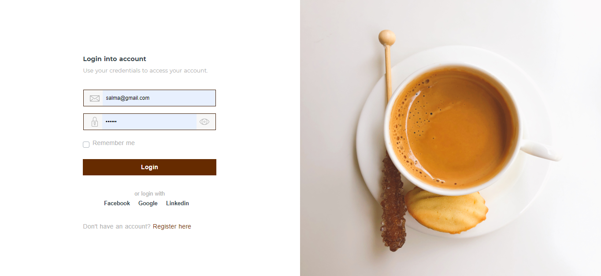
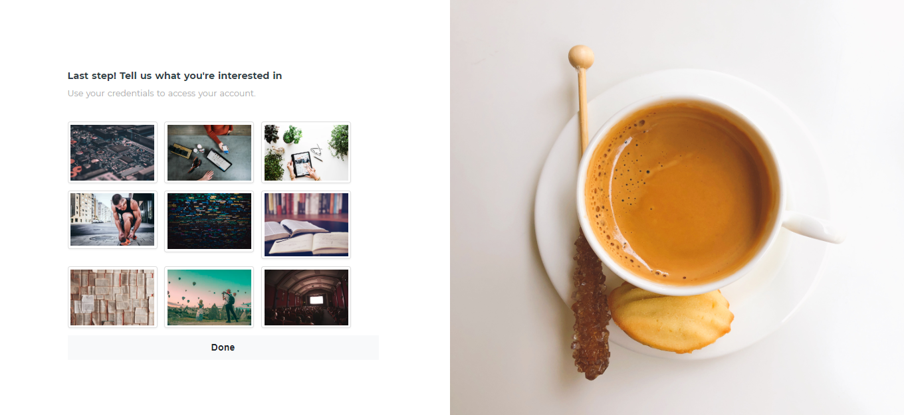
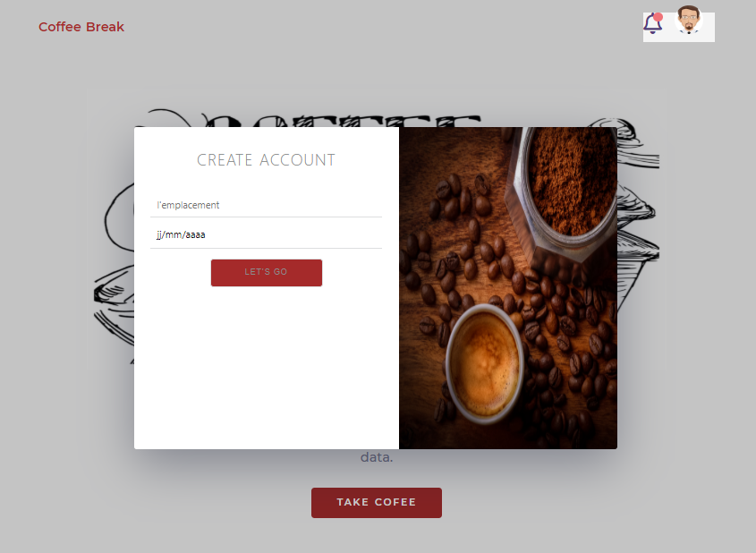

# La plateforme Random coffee

> Cette section présente les différentes composantes de la plateforme Randomcoffee.

## La page d'accueil

L'utilisateur peut s'authentifier par quatre maniere (e-mail et mot de passe / facebook / google / linkden)

## Choix des interets

## Fixer un rendez-vous 

